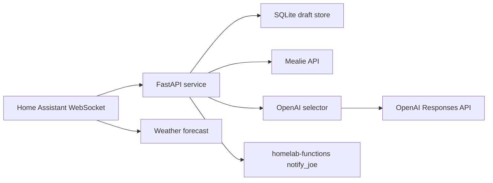

# Architecture

Mealie Planner is a small FastAPI service with four boundaries:

1. Mealie API reads recipe metadata and writes accepted dinner plans.
2. Home Assistant provides weather context and mobile notification action events.
3. `homelab-functions` sends Joe's phone notifications.
4. OpenAI chooses the plan from compact candidate recipe metadata.

The core planning logic is intentionally isolated under `mealie_planner/selection/`:

- `rules.py` handles deterministic date selection and recipe prefiltering.
- `openai_selector.py` owns the prompt, compact payload, Responses API call, and structured-output schema.
- `schema.py` validates accepted model output against candidate recipe ids and requested dates.

The OpenAI request excludes full recipe instructions and full ingredient lists by default. It sends recipe id, slug, title, categories, tags, tools, servings, and a small ingredient-anchor list.

Notification buttons are not handled by `homelab-functions`; the app listens directly to Home Assistant `mobile_app_notification_action` events and routes Accept, Regenerate, Dismiss, and typed replies.

